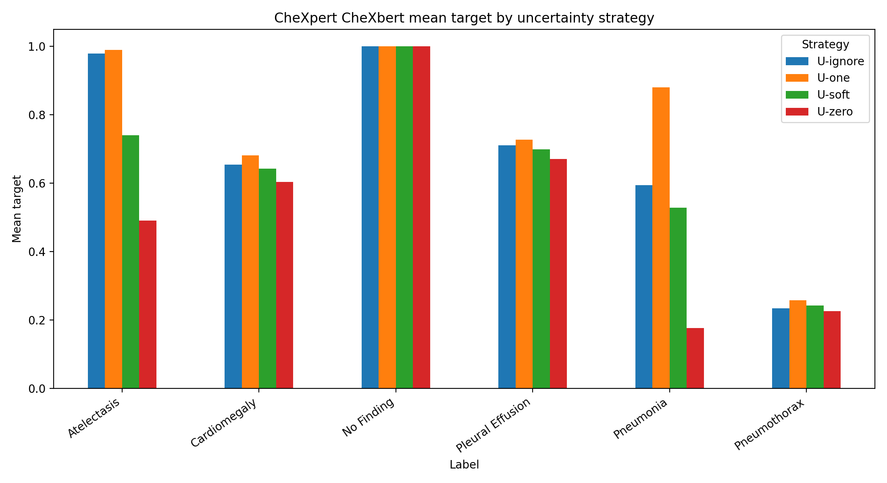
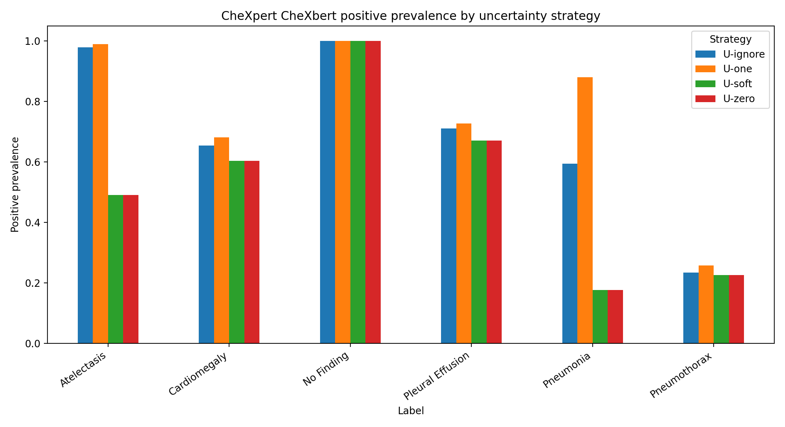
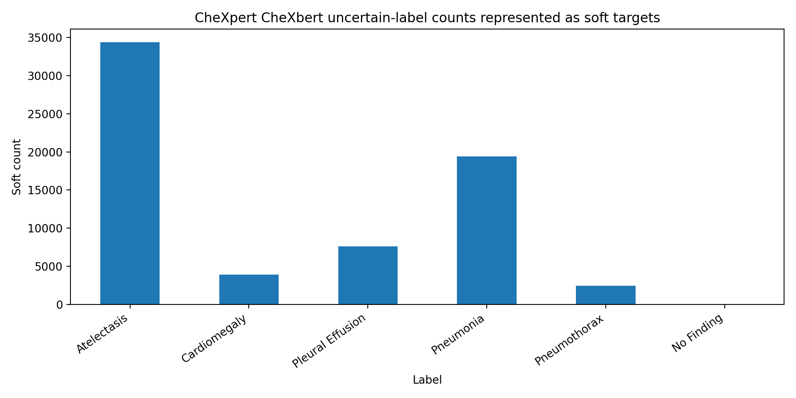

# MedShiftLab-CXR

## Overview

MedShiftLab-CXR is a reproducible research scaffold and data-centric evaluation framework for studying pretrained chest X-ray foundation models under annotation uncertainty and cross-dataset distribution shift.

MedShiftLab-CXR currently has no hosted live demo and no frontend/API surface. The repository is a reproducible research scaffold and data-centric evaluation framework.

## Research question

“How do annotation uncertainty, dataset curation choices, and cross-dataset distribution shift influence the robustness, calibration, and failure modes of pretrained chest X-ray foundation models?”

## What is implemented

- Label ontology and uncertainty handling
- CheXpert metadata schema and loader
- VinDr-CXR metadata schema
- Dataset registry and path-free local configuration template
- Reusable JPEG/PNG image loading, path containment, and preprocessing
- Dataset summary generator
- Evaluation metrics and `EvaluationReport` schema
- Evaluation table interface
- Standardized prediction schema and adapter protocol
- Optional TorchXRayVision adapter boundary
- Manual-only baseline TorchXRayVision inference path for small local subsets
- Standardized prediction-evaluation orchestration for local prediction files
- Prediction-to-evaluation bridge
- JSON/CSV export utilities
- In-memory and file-exporting experiment runners
- Focused test runner
- Real CheXpert CheXbert metadata-analysis outputs
- Standalone scripts for a bounded TorchXRayVision image-inference path

## Real CheXpert metadata analysis

The current real-data artifact set was produced from a local CheXpert `train_cheXbert.csv` file. Raw dataset files and images are not committed.

- `n_records = 223414`
- `n_patients = 64540`
- `n_records_without_patient_id = 0`
- Strategies compared: `U-ignore`, `U-zero`, `U-one`, and `U-soft`

This is metadata analysis, not image inference and not model benchmarking.

## Prior subset inference artifact

The repository also tracks aggregate artifacts and documentation from a prior standalone TorchXRayVision run over a 1,000-image frontal CheXpert subset. See [the run documentation](docs/medshiftlab/real_image_inference/chexpert_small_frontal1000.md) and [derived result summary](results/real_runs/chexpert_small_frontal1000_torchxrayvision/README.md).

This prior run is a smoke/subset execution record, not a completed benchmark, external validation, or clinical validation. Its inference path is implemented in standalone scripts. Package-level image loading, a standardized prediction schema/adapter interface, and a manual-only baseline TorchXRayVision inference path now exist. Real execution still requires authorized local data, explicit local configuration, optional dependencies, and an intentionally small subset limit by default.

Standardized prediction evaluation is also available for local prediction JSON/CSV files and matching local label CSV files. This path is manual-only, uses the existing evaluation/report schema, and does not by itself establish benchmark completion, external validation, or clinical validation.

## Results and figures

- [Analysis documentation](results/real_runs/chexpert_train_chexbert_uncertainty_comparison/README.md)
- [Label summary CSV](results/real_runs/chexpert_train_chexbert_uncertainty_comparison/chexpert_uncertainty_strategy_label_summary.csv)
- [Dataset summary CSV](results/real_runs/chexpert_train_chexbert_uncertainty_comparison/chexpert_uncertainty_strategy_dataset_summary.csv)
- [Mean target by uncertainty strategy](figures/chexpert_train_chexbert_uncertainty_comparison/mean_target_by_uncertainty_strategy.png)
- [Positive prevalence by uncertainty strategy](figures/chexpert_train_chexbert_uncertainty_comparison/positive_prevalence_by_uncertainty_strategy.png)
- [Soft counts by label](figures/chexpert_train_chexbert_uncertainty_comparison/soft_counts_by_label.png)







## How to run tests

```bash
bash scripts/run_medshiftlab_tests.sh
```

## Repository structure

```text
src/medshiftlab/       Core data, label, model-boundary, evaluation, experiment, and reporting modules
scripts/               Metadata-summary, plotting, and focused-test entry points
tests/                 Focused MedShiftLab-CXR tests
docs/medshiftlab/      Research protocol and implementation documentation
results/real_runs/     Commit-eligible derived summaries from authorized local runs
figures/               Generated research figures
```

Raw and restricted medical datasets must remain outside Git.

## Current limitations

- No clinical validation or diagnostic deployment
- No completed benchmark or external validation
- No benchmark-grade or full-dataset integrated inference workflow
- No completed full-dataset prediction-evaluation workflow
- No model training
- No state-of-the-art (SOTA) or regulatory claim
- No hosted live demo
- No frontend/API in the active project

## What is not claimed

This repository includes no clinical validation, diagnostic deployment, completed benchmark, external validation, model training, hosted live demo, or frontend/API. It makes no SOTA or regulatory claim. The tracked prior subset inference artifacts do not establish clinical performance, generalization, or package-level inference integration.

## Suggested next steps

1. Populate the ignored local-path configuration only in an authorized local environment.
2. Add bootstrap/calibration artifacts and stricter run manifests around the manual-only prediction-evaluation path without broadening the default path into full-dataset execution.
3. Run the frozen internal protocol before any strict external validation on MIMIC-CXR-JPG and/or VinDr-CXR.

## Citation/status note

This repository is an active PhD-application research scaffold, not a clinically validated system. No formal paper citation is assigned yet; cite the repository and the exact release tag used when referencing these artifacts.
